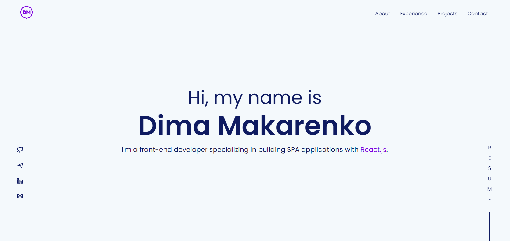

<div align="center">
  
</div>

<p align="center">
  
</p>

# Getting Started

It is recommended that you work through the Storybook guides in the order they appear in the navigation panel on the left. The guides have been designed to introduce you to project in a logical order and steadily build up your knowledge as you progress through them.

## 🛠 Installation & Set Up

1. Clone the repository into your local workspace

   ```sh
   git clone https://github.com/DimaMakarenko/portfolio.git
   ```

2. Move into the project and install the dependencies

    ```sh
    cd portfolio && npm install
    ```
3. Start the development server

   ```sh
   npm start
   ```


## 🧪 Testing

It is recommended to check [React testing library docs](https://testing-library.com/docs/react-testing-library/intro/) along with [Common mistakes with the lib](https://kentcdodds.com/blog/common-mistakes-with-react-testing-library) before jumping into testing.
To work with test runner use following instructions:

Run the Jest test suite:

    npm run test


## 📕 Storybook

Run Storybook in development mode:

    npm run storybook

## 🚀 Building and Running for Production

Generate a full static production build

   ```sh
   npm run build
   ```
